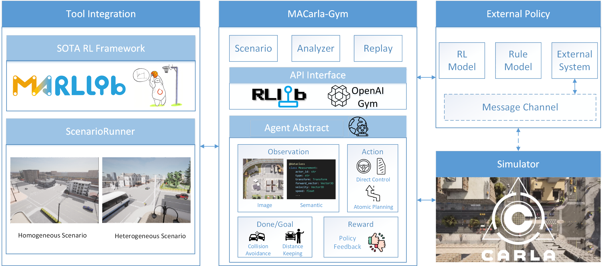

# CMAD-Gym

a High-level Customizable Multi-agent Gym for Dependable Autonomous Driving



# Prerequisite

To run CMAD-Gym correctly, you'll have to make sure these following environment variable are set:

```bash
vim ~/.bashrc

# in .bashrc
export CARLA_ROOT=${HOME}/software/CARLA_0.9.13
export CARLA_SERVER=${CARLA_ROOT}/CarlaUE4.sh

# Optional, since 0.9.13 Carla PythonAPI can be installed through pip
export CARLA_EGG=$(ls ${CARLA_ROOT}/PythonAPI/carla/dist/carla-0.9.13-py3.*.egg 2>/dev/null)
export PYTHONPATH=${CARLA_EGG}:${CARLA_ROOT}/PythonAPI/carla:${PYTHONPATH}
```

> 1. `CARLA_ROOT` should be the installation directory of your Carla.
> 2. If your Carla server is installed on a remote machine, the first two variables are not necessary.


# Features

## Observation

1. Global Observation Support

    You can setup a global sensor per env. This can be described in "env" configurations, see [Town01Sim](./src/cmad/envs/example/town01_npc.py) for more detail.

    This camera data can be used for both observation data and visualization.

    > You can either attach this sensor to an actor in the scenario, or pose it at a static location

2. More detailed semantic information.

    When you enabled "send_measurements", the env will return a 1 dimensional numpy array alongside the camera observation. This array is flattened from these information:

    ```python
    info = {
        "active": "binary int number indicating whether the actor is still running",
        "x": "float number of relative longitudinal position in reference actor frame",
        "y": "float number of relative lateral position in reference actor frame",
        "heading": "float number of relative heading between current and referenced actor",
        "vx": "float number of longitudinal speed in reference actor frame",
        "vy": "float number of lateral speed in reference actor frame",
        "speed": "float number of speed",
        "road_offset": "float number of lateral offset from the center of road",
        "bounding_box": "bounding box (bottom two/four points) in reference actor frame",
        "waypoints": "planned waypoints in reference actor frame (only for self vehicle, others planning is padded with 0)",
    }
    ```

    > By default, we've transformed all actor info from the world reference into "current" actor's reference. E.g. the location of a vehicle itself will be (0, 0, 0) instead of (x, y, z) where you get from `actor.get_location()`.

    - This is semantic information for one actor. We concatenate all vehicles semantic info into a single array in `obs`.
    - You can choose to use only some of these semantic info by adding "measurement_type" in "env" config, for example:
    
        ```python
        config = {
            "env": {
                "obs": {
                    "send_measurements": True,
                    "measurement_type": ["active", "x", "y", "vx", "vy", "heading"]
                }
            }
        }
        ```

        > By default, we return all of them.

3. Dict format observation for each agent

    To better structure and extend the observation space, we use gym.Dict to hold information of each agent. The following example shows the full observation we can provide now:

    ```python
    obs = {
        "actor1": {
            "camera": np.ndarray,
            "state": np.ndarray,
            "action_mask": np.ndarray
        }
    }
    ```

    - Each agent will have at least `camera` in its observation (although the value can be None if no camera attached).
    - `state` is the semantic information, enabled by the flag `send_measurements` in obs config.
    - `action_mask` is useful in discrete action space, it can be enabled by the flag `add_action_mask` in obs config.

## Action

1. Action config

    You can specify the "action module" for each actor in the scenario by providing a "action" dictionary in either "env" part or "actors" part.

    - In "env": Action config defined in "env" part will be seen as a fallback config for all actors. If you don't specify "action" in "actors" part, the env will use the "action" config in "env" part.
    - In "actors": Action config defined in "actors" part will override the "action" config in "env" part. If you don't specify "action" in "actors" part, the env will use the "action" config in "env" part.
    - Not specified: If you don't specify "action" in both "env" and "actors" part, the env will use the default action config. (LowLevelAction that will apply to both vehicle and walker)

    Example of action config:

    ```python
    configs = {
        "env": {
            # ... other configs
            "action": {
                "type": "custom_action",
                "use_discrete": True,
                "discrete_action_set": {
                    0: "forward",
                    1: "brake",
                    2: "left",
                    3: "right",
                }
            }
        }
    }
    ```

    An action module should inherit from `cmad/agent/action/action_interface.py`, for more detail, see any implementation under the same folder.

2. Synchronized command

    Most gym environments uses ["asynchronously action"](https://github.com/praveen-palanisamy/macad-gym/blob/1006e849ff4c5bf5d29cb43ab8c2a0bdcc992367/src/macad_gym/carla/multi_env.py#L1292-L1298), i.e. the simulator will tick right after each `actor.apply_control`. This can be confusing for the RL model, because the observation of each actor is actually not at the same timestamp.

    We use BatchCommand as much as possible to make sure any behavior that could change the state of the simulation will perform as expected.

## Reward function

Unlike most gym environment, in which you can only modify the reward function by editing the source code, we provide an API to register your customize reward function. See [navigation scenario](./src/cmad/envs/example/navigation.py) as an example.

## Done strategy

Within a Multi-Agent Framework, individual agents might have distinct objectives. As such, the decision on whether a task is "completed" should be tailored to each agent. There are two instances of done_criteria in our configuration:

1. "done_criteria" under the `"env"` configuration.

    This directly influences the `done["__all__"]` status. By default, an episode is considered completed when "all npc agents" have finished their tasks.

2. "done_criteria" within the `"actors"` configuration.
   
    For every agent, there's an option to specify their unique completion strategy. We offer several pre-defined strategies that can be selected by stating their identifier:

    - "collision": Marks completion when the actor encounters any form of collision. This requires a collision sensor.
    - "offroad": Activates when a vehicle deviates off its intended path. It's determined via waypoint without needing a sensor.
    - "reach_goal": Triggers once the actor arrives at its target location.
    - "time_out": Executes upon reaching the maximum limit for episode steps.

Creating your own custom completion strategy is straightforward, analogous to the reward module:

```python
from cmad import Done
Done.register_custom_strategy("never", lambda: False, force=True)
```

For more example, see [setup_done_strategy](./src/cmad/agent/done/__init__.py)

## Scenario Definition

1. We provide a new config `max_time` in "scenarios" configuration, to automatically calculate how many steps can the agent take. You can also use `max_steps` as a call limit to `env.step()`.
    
2. Instead of supporting only list-like position definition, we added support for xodr parameter support for start/end location. See [Town01 scenario](./src/cmad/envs/example/town01_npc.py) as an example 

# Integration with MARLlib

Multi-Agent RLlib (MARLlib) is a comprehensive Multi-Agent Reinforcement Learning algorithm library based on Ray and one of its toolkits RLlib. It provides MARL research community with a unified platform for building, training, and evaluating MARL algorithms.

Our [fork of MARLlib](https://github.com/TrustAISys/MARLlib) provide the integration of CMAD-Gym, so you can train your RL Agent in one line. Below will show you the setup steps:

1. Create a new conda environment.

    ```bash
    conda create -n marllib python=3.8

    conda activate marllib

    python -m pip install "pip<24.0.0"
    ```

2. Install CMAD-Gym.

    ```bash
    # Install carla PythonAPI manually to meet your Carla version.
    pip install carla==0.9.13

    # Clone this repo
    git clone https://github.com/TrustAISys/cmad-gym
    cd cmad-gym

    # Install with extra ray dependencies
    pip install -e ".[ray]"
    ```

    The above lines will install this repo.

3. Install MARLlib

    First you'll need to install Pytorch<=1.13.1, see [official tutorial](https://pytorch.org/get-started/previous-versions/#linux-and-windows-11) for more platform support.

    ```bash
    # We mainly use 1.9.1, but 1.13.1 has been tested
    pip install torch==1.9.1+cu111 torchvision==0.10.1+cu111 torchaudio==0.9.1 -f https://download.pytorch.org/whl/torch_stable.html
    ```

    Second, clone MARLlib to a local directory. Install this local repo using pip and do the patch.

    ```bash
    # Clone our fork of MARLlib
    git clone https://github.com/TrustAISys/MARLlib.git
    cd MARLlib

    # Install with dependencies
    pip install -e .

    # Add necessary patch (Must)
    python ./marllib/patch/add_patch.py -y
    ```

    For the combination of CMAD-Gym and MARLlib, these steps above should prepare you well. However, if you want to use other environment integrated in MARLlib, you may have to look into the official [document of MARLlib](https://marllib.readthedocs.io/en/latest/handbook/env.html)

4. Start training

    You can use this single line to start training. Currently only mappo has been tested.

    ```bash
    cd MARLlib
    
    bash scripts/start_training.sh
    ```

    If you want to change the scenario of CMAD-Gym or do some other finetuning, the following two files are the one you'll have to change:
    - MARLlib/marllib/main.py
    - MARLlib/marllib/marl/algos/hyperparams/finetuned/cmad/${algo_you_use}.yaml
